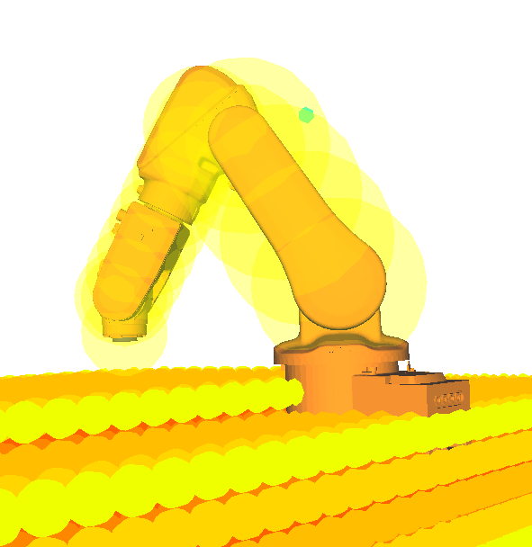

voxel-collision-checker-plugin
==============================

The collision checker relies on a voxel grid representation of a distance field. The field is generated by sweeping a cube through the scene and checking for collision using the regular collision checker. The distance is then propagated in the voxel grid to obtain the distance field. It automaticly computes the collision points to match the robot's geometry (see image). It also returns a collision potential which is higher when the robot penetrates the obstacles. It computes minimal distance to the obstacles to asses if the robot is colliding with the environment. See the examples directory for usage.

### Dependencies:

* OpenRAVE : http://openrave.org/docs/latest_stable/

#### Install:

    mkdir build && cd build
    cmake ..
    make install
    
 Set up your enviroment:

    export OPENRAVE_PLUGINS=$HOME/voxel-collision-checker-plugin/plugins:$OPENRAVE_PLUGINS
    
#### Run:
    
    cd examples && python pr2_simple_example.py
